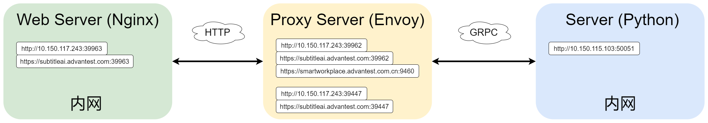

## 项目说明

本项目是一款跨平台的实时语音翻译 Web 应用，旨在为用户提供高效、便捷的语音翻译服务。通过结合 TypeScript 和 Rust WebAssembly 的强大功能，我们提供了高效、精准且低延迟的语音翻译服务，助力用户轻松突破语言障碍，畅享无缝沟通。   

内网: [https://subtitleai.advantest.com:39962/](https://subtitleai.advantest.com:39962/)
公网: [https://smartworkplace.advantest.com.cn:9460/](https://smartworkplace.advantest.com.cn:9460/) （目前无法使用）

### 核心功能

* **实时语音翻译：**用户可以通过麦克风输入语音，系统自动识别并实时翻译为目标语言，支持多种语言间的无缝切换。
* **跨平台支持：**应用基于 Web 技术开发，可在桌面端和移动端的现代浏览器中流畅运行，无需额外安装任何客户端程序。

* **自动语音分段：**内置自动语音分段功能，可智能识别语音中的句子边界，提升翻译结果的准确性和连贯性。

### 项目优势

* **跨平台兼容：**支持主流设备，无需额外配置即可快速上手。
* **现代化技术栈：**
  * **Vite**：极速构建工具，提供高效的开发和构建体验。
  * **React + TypeScript**：实现组件化的 UI 开发和类型安全的代码规范，提升代码质量与可维护性。
  * **Rust WebAssembly**：利用 Rust 的高性能与内存安全性特点，将音频处理模块封装为 WebAssembly，显著提升实时语音处理的速度和稳定性。WebAssembly作为一种跨平台的二进制指令格式，与 Rust 深度结合，将音频处理模块封装到前端，直接在浏览器中实现接近本地的计算性能，打破传统 Web 应用性能的瓶颈。
* **高性能音频处理：**采用 WebAssembly 技术实现音频的快速解析与处理，结合 Rust 提供的性能优势，确保语音识别和翻译过程的低延迟表现。

### 项目架构

### 基本命令

- **`yarn start`**: 启动网站，用于本地开发。
- **`yarn build`**: 构建生产版本。
- **`yarn grpc-web`**: 使用 `protoc` 工具生成 gRPC-Web 客户端代码。  
  **命令**: `./protoc-3.20.0-win64/bin/protoc --proto_path=./proto chat.proto --js_out=import_style=commonjs:./proto --grpc-web_out=import_style=typescript,mode=grpcwebtext:./proto`  
  **说明**: 编译 `.proto` 文件并生成 TypeScript 客户端代码以供 gRPC-Web 使用。
- **`yarn wasm-web`**: 构建 WebAssembly 模块并生成 web 目标的代码。  
  **命令**: `wasm-pack build ./subtitle-webapp-rust-crate --target web && yarn update`  
  **说明**: 使用 `wasm-pack` 构建 Rust WebAssembly 模块，并通过 `yarn update` 更新相关依赖。
- **`wasm-no-modules`**: 构建 WebAssembly 模块，生成没有模块化支持的代码。  
  **命令**: `wasm-pack build ./subtitle-webapp-rust-crate --target no-modules`  
  **说明**: 构建不支持模块化的 WebAssembly 代码，适用于某些不支持模块的环境。
